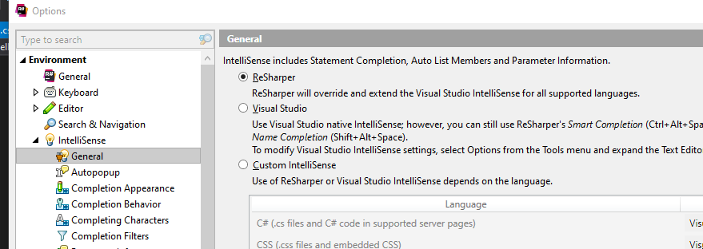
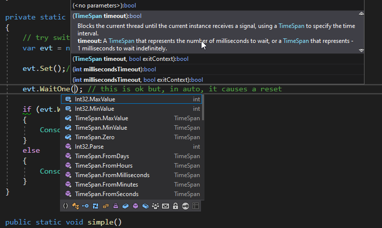

VisualStudio中常用的快捷键：

### 1.常用快捷技巧

Ctrl + Home键：回到文档的顶部

Ctrl+End键：回到文档的底部

Home键：移动到行首，按两次Home键，直接移动到边框最左端

Ctrl +R 连按2次：修改变量名。在安装了Resharp插件的时候，这个功能会同时把整个解决方案中的类名文件名，接口文件名一起修改，非常方便，特别是代码重构的时候加快开发效率。

### 2.给VisualStudio2019设置合适的字号

#### 1.设置全局菜单、侧边栏字体大小：

#### 2.设置代码编辑区域popup提示弹窗内字体大小：

### 3.自动注入私有属性设置

#### 1.自动生成私有变量属性

可以强制设置私有变量为 ‘_' 带有下划线的小驼峰方式：

设置完毕之后：

我这里选择的是Refactoring Only：

最终使用的效果就是如下：visualstudio 2019会把含有依赖注入的属性，自动给你补上，并且打上私有属性下划线。

如果没有这个设置，那么编辑器给出来的自动提示就是如下这种：

这个设置在依赖注入的时候，使用起来特别方便。

### 4.提升vs效率

#### 1.Shift + Enter 

这个按键组合，专门用来快速输入`大花括号`，当你输入一个类或者方法，需要敲入 `{  }   `一对大花括号的时候，直接Shift +Enter即可快捷输入，并且光标会停留在花括号的真正中间开始的位置。

#### 2.Move Class

这个功能可以把cs文件中的class类单独移动出去成为一个独立的class文件,当从其他文件拷贝class类和代码的时候这个技巧非常有用。可以先把class代码拷贝到一个namespace中，然后使用这个Move type to    XXXX.cs ，就会单独把某个class新建为单独的cs类文件。

#### 3.自动复制文件顶部的using语句

当你进行代码的复制粘贴的时候，如果从一个文件A复制了一段代码，带有using引用的，当你拷贝到B文件的时候，想要连同A文件顶部的相关的using语句也一并拷贝到B文件，那么就可以开启这个功能。

#### 4.继承关系跳转

开启这个功能之后，可以使得visual studio 2019编辑器的侧边栏显示蓝色的标记，鼠标点击之后，可以在拥有继承关系的类之间引进跳转。

#### 5.移除不用的Nuget包

这个是visual studio 2019 16.10.3 版本之后自带的功能，老版本的vs可能没有这个功能。

#### 6.EditorConfig文件统一开发风格

visualStudio中可以为项目添加EditorConfig文件，来统一整个开发团队的开发规范，比如单行代码缩进量的控制。

具体的设置可以参考：[使用 EditorConfig 创建可移植的自定义编辑器设置](https://docs.microsoft.com/en-us/visualstudio/ide/create-portable-custom-editor-options?view=vs-2019)

EditorConfig的更多规范参考[EditorConfig](https://editorconfig.org/)官方网站。

如果开启了EditorConfig文件，那么visualsudio编辑器的ErrorList提示里面会有Messages消息，提示你进行一些代码规范上面的操作：

EditorConfig的配置文件修改了之后，可以通过CleanCode一键格式化我们的代码文件：最典型的使用，就是格式化代码的缩进这些，如果对于[EditorConfig](https://editorconfig.org/)研究更深入，可以最大限度的规范我们开发风格。

#### 7.抽取class类中的接口

这个方法跟上面的第2个方法，抽离class到单独的cs文件类似，是把class中的现有方法抽离出去，变为接口。这个在dtonetcore依赖注入的时候，要提取某些接口非常方便。

#### 8.Resharp插件

Resharp官方文档：如果是首次安装Resharp，请查阅官方文档：[使用Resharp第一步](https://www.jetbrains.com/help/resharper/First_Steps.html)。快速打开Resharp的设置页面使用快捷键：(**Alt+R, O**).这里只会使用到Resharp的关键几个功能：

1.代码智能提示修改为使用Resharp代替。设置完成之后，API接口的形参提示会直接弹出提示，提升编码效率。这里影响的是上方这块参数的智能提示。下方的那块智能提示是vs2019微软的AI提示给出来的信息。

另外使用快捷键，ctrl + shift + space 也是可以弹出来参数智能提示的；

2.代码块的注释、取消注释

**Ctrl + Atl + /**        对于选中的代码块，注释、取消注释，都是这3个组合键。参考官方文档：[注释和取消注释代码](https://www.jetbrains.com/help/resharper/Coding_Assistance__Comment_Uncomment_Code.html)

### 5.微软的AI提示

微软的AI代码提示功能靠下面的Visual Studio IntelliCode给出来的。

微软的这个AI提示会根据经验值，把频率最高的API给排序显示出来，方便日常快速开发。默认的设置是通用的，并不是针对C#的，如果是开发.net的话，需要把所有专门针对C#的智能提示给开启：最新版vs2019这里有9项全部开启。那么AI智能提示就全部是针对C#的。

完成这些设置之后，通过view菜单进入到Visual Studio IntelliCode界面；

进入到这个页面之后点击生成Patterns，那么就会根据你当前项目中使用到的有些语法特征，分析出AI模型，对你当前的项目提供特定的AI智能提示：数据模型创建完毕之后处于Ready状态。开启这个功能之后，以后每次打开一个已经存在于电脑硬盘上面的.net项目都会自动开启本地Local的Ai分析，这个插件对应的AI程序会针对本地的代码进行AI建模分析，给出合理的代码提示建议。

